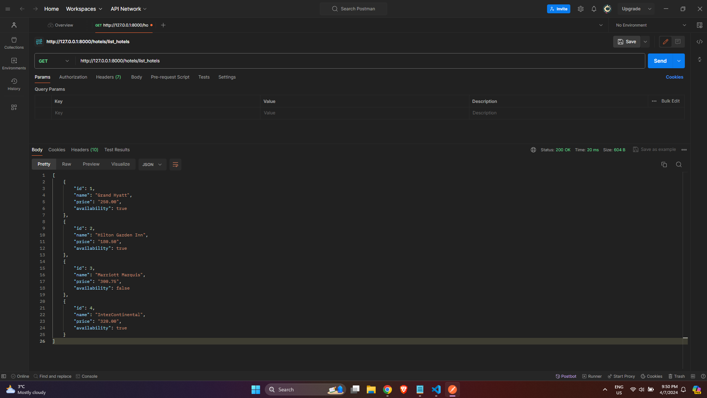
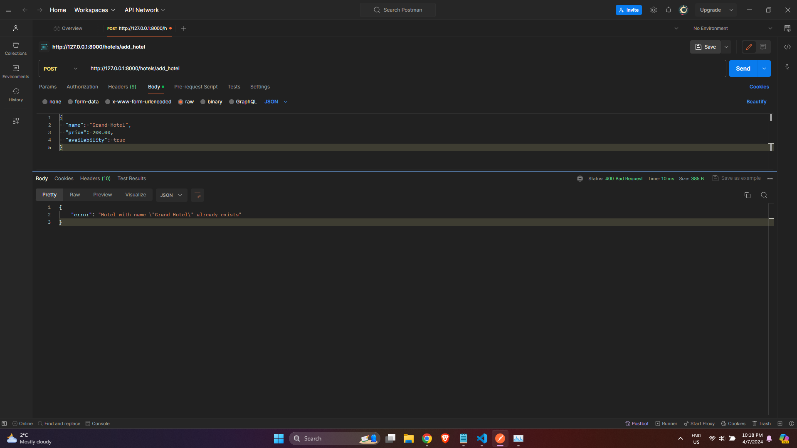

# DJANGO REST API ASSIGNMENT - MCDA 5550 - Saint Mary's University

This is a Django application that provides APIs to retrieve a list of hotels stored in the SQLite database and to add a hotel to the list of hotels in the database. The API provides the following methods:

## GET Method to Retrieve a List of Hotels in the Database

The following URL can be used to retrieve a list of hotels from the database:

**API URL:** `http://127.0.0.1:8000/hotels/list_hotels`

**Sample Response:**
```
HTTP 200 OK
Allow: GET, OPTIONS
Content-Type: application/json
Vary: Accept

[
    {
        "id": 1,
        "name": "Grand Hyatt",
        "price": "250.00",
        "availability": true
    },
    {
        "id": 2,
        "name": "Hilton Garden Inn",
        "price": "180.50",
        "availability": true
    }
]
```

### Screenshot of GET Response:



## POST Method to Add a Hotel to the Database

The following URL can be used, along with the request body (a JSON object), to add a hotel to the database:

**API URL:** `http://127.0.0.1:8000/hotels/add_hotel`

**Sample Request Body:**
```json
{
    "name": "Radisson Blu",
    "price": 200.25,
    "availability": true
}
```

**Sample Successful Response:**
```
HTTP 200 OK
Allow: OPTIONS, POST
Content-Type: application/json
Vary: Accept

{
    "Message": "Hotel added successfully to the database"
}
```

### Screenshot of Successful POST Method:


**Sample Unsuccessful Response:**
```
HTTP 400 Bad Request
Allow: POST, OPTIONS
Content-Type: application/json
Vary: Accept

{
    "error": "Hotel with name \"Grand Hotel\" already exists"
}
```

### Screenshot of Failed POST Method for Duplicate Hotel:
